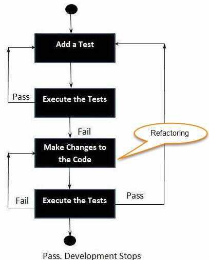

# Test Driven Development - TDD

## About

Test-Driven development (TDD) is a process of developing and running automated test before actual development of the application.

Following steps define how to perform TDD test,

1. Add a test.
1. Run all tests and see if any new test fails.
1. Write some code.
1. Run tests and Refactor code.
1. Repeat.

## Things to Remember

The TDD process and why the steps are important

1. Write a failing test and see it fail so we know we have written a relevant test for our requirements and seen that it produces an easy to understand description of the failure
1. Writing the smallest amount of code to make it pass so we know we have working software
1. Then refactor, backed with the safety of our tests to ensure we have well-crafted code that is easy to work with

Tips:

- Hello World TDD will challenge your fundamentals
- You need to write Failed Test First - before writing actual Functionality
- You might feel uncomfortable to write a piece of code that Fails
- Get Comfortable in being Uncomfortable Today
- You might be tempted to Google for things you don’t understand - Don’t Do It. Stay with the Guide
- Note Down What you Don’t Understand & What your Understood
- Happy Coding
