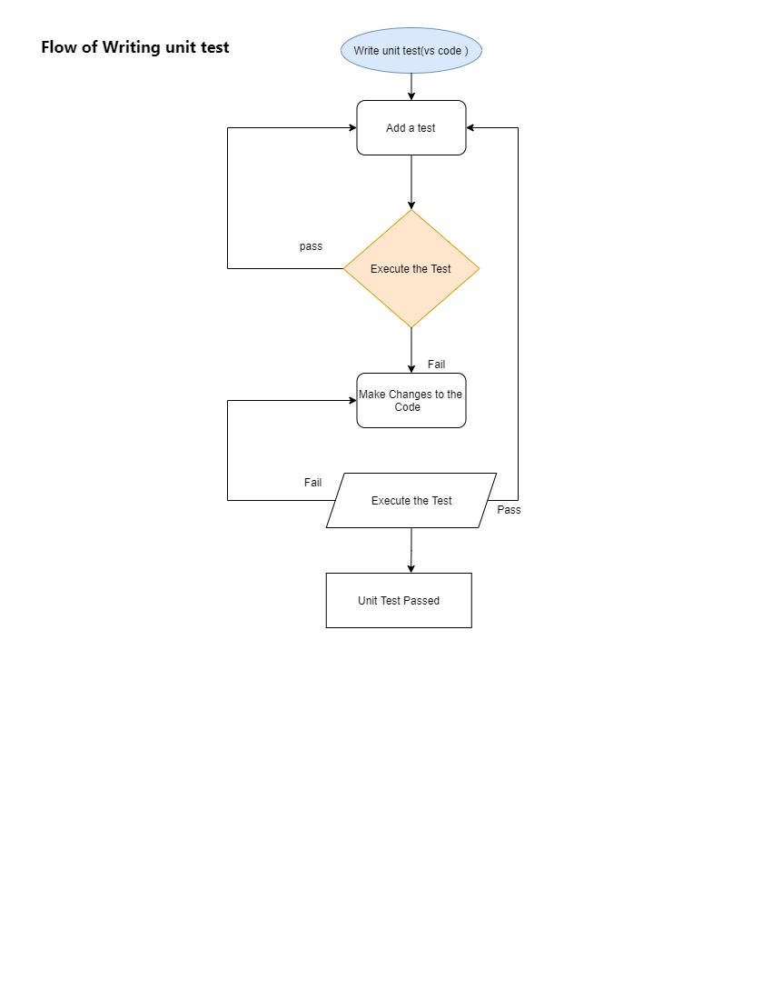

# TDD (Test Driven Developement) with Golang (with the "Hello World" unit test case)

## Detailed Descriptions

### Test Driven Developement (TDD) 

It is a skill that needs practice to develop but by being able to break problems down into 
smaller components  that can be tested, It is much easier writing software.
It is a development technique where it is good to write a test that fails before we enter into writing new functional code.

“Test-driven development” refers to a style of programming in which three activities are tightly interwoven: 
1.coding (set of instructions written in vs code editor)
1.testing (in the form of small instructions to execute unit tests) and 
1.design (in the form of refactoring)

### Writing a unit test is just like writing a function, we follow some rules to write a test:

1. It needs to be in a file with a name like xxx_test.go
1. The test function must start with the word " Test"
1. The test function takes one argument only "t *testing.T" 
1. In order to use the *testing.T type, you need to import "testing" package.

### Flow of Writing Unit test Case on "Hello World" Program : 

1. Write test Case [on Hello World which returns "Hello World" as a string].
1. Check with go test commands .. test will fail (because of lack of functionality).
1. It will show Compilation error on the console (hello function is undefined because of lack of functionality).
1. Add Functionality to Hello World function which returns as empty string. 
1. Again unit test will fail because of unexpected output.
1. More code is written to make the test pass.
1. According to Requirements, Unit test will pass.
1. Add more test cases (checking more test case with different expected outputs).
1. Refactor the code to fulfill the requirements.

#### Note : Repeat the same procedures to add more requirements

### Code Enhancement Steps (to get desired output in such unit tests)

1. Wrote "Hello()"
1. Add Argument "Hello(string)"
1. Add Constant and Variable for refactoring like const englishHelloPrefix = "Hello, "
1. Add Requiremnets like when our function is called with an empty string it defaults to printing "Hello, World", rather than "Hello, ".
1. Add more requirements(We now need to support a second parameter, specifying the language of the greeting)
1. Convert if condition into switch statement.
      (When you have lots of if statements checking a particular value it is common to use a switch statement instead. We can use switch to refactor the code to make it easier to read)
1. Incase of argument if function is getting bigger.The simplest refactor for this would be to extract out some functionality into another function.(we can split it)

### Refactor 

1. Refactor the code  as a varible , constant, function should be having single functionality.
1. Refactor, backed with the safety of our tests is to ensure we have well-crafted code that is easy to work with.
1. Refactor the testing code well, is to avoid duplication of code 
1. clean and clear code (good readability)
1. each contains its own functionlity

### In our case we've gone from Hello() to Hello("name"), to Hello("name", "French") in small, easy to understand steps.
With Some of Go's syntax around
1. Writing tests
1. Declaring functions, with arguments and return types
1. if, const and switch
1. Declaring variables and constants

