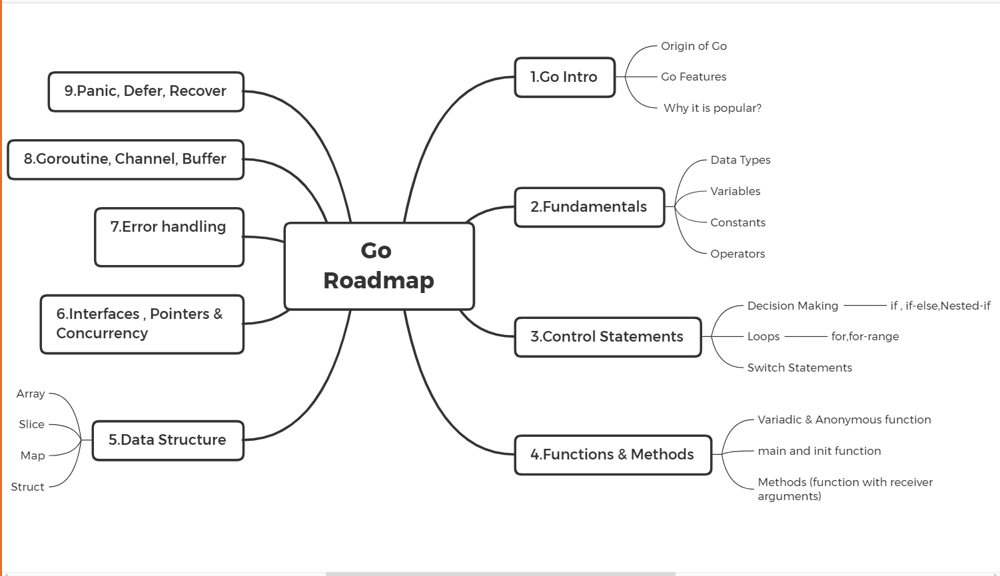

# Fundamental Study Guide Project Charter

## Purpose of Prepraing the Study Guide - Why ?

## Success Criteria - What ?

## Identify Stakeholders / Customers - Mapping
1. Raja and / or Maneesh
1. Stakeholders analysis the process of accessing and the potential changes should be relavent to the stakeholders.
1. Assess the intrest of the stakeholders to be addressed inline with the project plan, scope and the policy.

## Acceptance Criteria
1. Prepare Study Materials for KT(Knowledge Transfer)
1. Prepare the demo for the reviewer to accept it.

# Overview about Project Charter

## About

Project charter is a statement of objectives in a project.It is a short document that explains the project in clear, concise wording for high level management. Project charters outline the entirety of projects to help teams quickly understand the goals,tasks, timelines, and stakeholders.
Note: A Concise flow may be added if required.

## Why

By understanding the scope of the Stakeholders / Customers and the final project deliverable that satisfies the customers requirement.
A project may be an application/software required specifically to carry set of activites.

## What are the success criteria

1. Established by the clients at the start of the project and are listed on a priority basis.
1. Alignment with the business objectives.
1. Able to make critical decisions based on KPI's(Key Performance Indicators) for the project.
1. the utmost success criteria may be the steps followed to perform or execute an application.It may be broken down into bits and bytes[small parts],sothat incase of blockers the hurdles can be easily sorted out.

## Identify Stakeholders / Customers - Mapping

While reviewing the scope of work ,it is important to intract with the stakeholder or customers in real time to understand the exact requirement and the inputs so that the project is inline with customer requirement.
